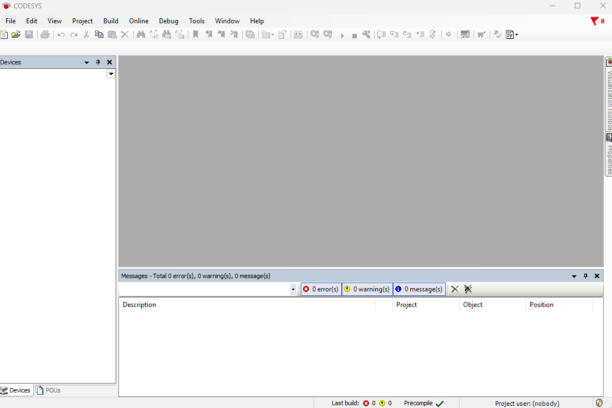
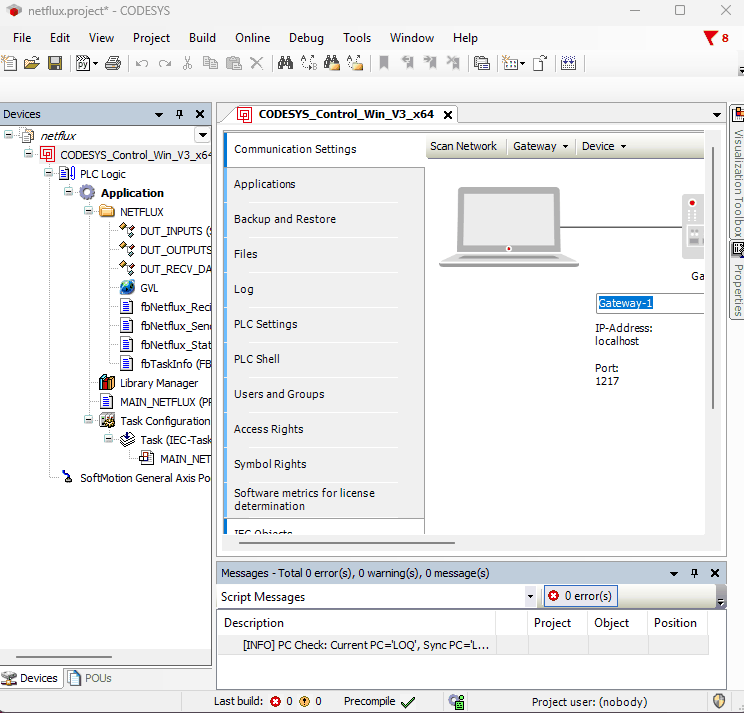
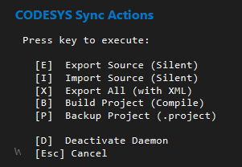

# cds-text-sync

**Version**: `1.5.0`

> [!IMPORTANT]
> **Disclaimer**: This is a third-party tool. It is NOT an official product of CODESYS Group and is not affiliated with, sponsored by, or endorsed by CODESYS Group. This tool is provided "as is" and is not a replacement for official CODESYS products.

This repository contains a set of Python scripts for **CODESYS** that facilitate a modern Git-based workflow for PLC development.

### ⚡ External Editing & Sync (The "Developer" Workflow)

- **Goal**: Edit code using modern external tools (VS Code, Cursor, Copilot) and sync changes back to CODESYS.
- **Method**: Exports logic (POUs, GVLs, DUTs) to clean **Structured Text (.st)** files.
- **Benefit**: You can refactor code, use AI assistants, or mass-edit variables externally. The `Project_import.py` script then seamlessly updates your open CODESYS project.

---

## 🚀 Key Features

- **Reversible Sync**: Round-trip editing for Structured Text files.
- **Binary Backup (Git LFS)**: Optionally keeps a synchronized copy of your `.project` file for version control.
- **Native XML Export**: Optionally exports visualizations, alarms, and text lists to XML for diffing.
- **Safety**: Built-in checks (PC Name, Project Name) to prevent overwriting the wrong project.
- **Bi-directional Deletion**: Keep your file system and CODESYS project in sync by removing orphaned files.
- **Background Service**: A daemon that provides global hotkeys (`Alt+Q`) for quick actions without switching windows.

---

## 🛠️ Installation

1. **Copy Files**: Copy all `.py` files to the CODESYS scripts directory:
   `C:\Users\<YourUsername>\AppData\Local\CODESYS\ScriptDir\`
   _(Note: You may need to create the `ScriptDir` folder manually if it doesn't exist)_.

2. **Access in CODESYS**:
   - The scripts will be available in **Tools > Scripting > Scripts > P**.

3. **Add to Toolbar (Recommended)**:
   - Go to **Tools > Customize > Toolbars**.
   - Add commands from **ScriptEngine Commands > P**.

   

---

## 📖 Script Overview

### 1. `Project_directory.py` (Setup)

**Run this first.** It links your current CODESYS project to a specific folder on your disk.



- Saves the path (`cds-sync-folder`) and current machine name (`cds-sync-pc`) to **Project Information > Properties**.
- This binding ensures you don't accidentally sync to the wrong folder.

### 2. `Project_parameters.py` (Configuration)

**Configure how the sync works.** Runs an interactive menu to toggle options. Settings are saved in the project file.

- **[ ] Export Native XML**:
  - If ENABLED: visual objects (Visualizations, Alarms, ImagePools) are exported to `/xml` folder in PLCopenXML format.
  - Useful for tracking changes in non-textual objects.
- **[ ] Backup .project binary**:
  - If ENABLED: the script creates a copy of your `.project` file in the `/project` folder.
  - Essential for **Git LFS** workflows. Ensures your binary state matches your code state.
- **Set Backup Name**:
  - Allows you to specify a **fixed filename** for the binary backup (e.g., `Project`).
  - **Why use it?** If you often rename your `.project` files or work in a team where project names vary, setting a fixed name ensures the backup always overwrites the same file. This keeps your `/project` folder clean and prevents Git history from being cluttered with "new" files that are just renamed versions of the old ones.
- **[ ] Save Project after Import**:
  - If ENABLED: automatically saves the project after a successful import.
- **[ ] Silent Mode**:
  - If ENABLED: suppresses blocking popup messages and uses non-blocking system tray notifications (toasts).
  - Recommended for "Developer Workflow" to stay in flow.

### 3. `Project_export.py` (CODESYS -> Disk)

Exports the current project state to the sync folder.

- **Source Code**: Exports all POUs, GVLs, DUTs to `/src` as `.st` files.
- **Libraries**: Saves `_libraries.csv` for dependency tracking.
- **Binary Backup**: If enabled, saves the project and copies it to `/project`.
- **Cleanup**: Detects files on disk that no longer exist in CODESYS and offers to delete them.

### 4. `Project_import.py` (Disk -> CODESYS)

Updates the CODESYS project from the files on disk.

- **Smart Update**: Updates existing objects, creates new ones, and builds folder hierarchies.
- **Deletions**: If a file was deleted from disk, offers to delete the object from CODESYS.
- **Binary Sync**: If "Backup .project binary" is enabled, it **automatically saves** the project after import and updates the binary backup, ensuring Git consistency.

### 5. `Project_Daemon.py` (Background Service)

**The ultimate productivity booster.** This script runs in the background and empowers you to control CODESYS from anywhere.



- **Global Hotkey (Alt + Q)**: Open the Quick Action Dashboard from any application or virtual desktop.
- **Silent Operations**: Perform Exports, Imports, and Builds without interrupting your flow with popup dialogs.
- **Smart Focus**: The dashboard intelligently steals focus when activated and restores it to your previous window (e.g., VS Code) when done.
- **Build & Log**: Trigger a project build and get a clean, table-formatted `build.log` directly in your project folder.

**Usage**:

1. Run `Project_Daemon.py` once inside CODESYS to start it.
2. Press `Alt + Q` to toggle the menu.
3. Press `D` in the menu or run the script again to stop it.

### 6. `Project_Build.py` (Compile & Log)

Triggers a full project build (Compile) and generates a detailed log file in your project folder.

- **Output**: Writes `build.log` to the sync folder.
- **Format**: The log uses a clean, fixed-width table format that is easy to read.
- **Accuracy**: Uses advanced heuristics to calculate accurate Line/Column numbers for errors, even when CODESYS reports incorrect positions (e.g., for `VAR` declarations).
- **Integration**: The specific error format allows external editors (like VS Code tasks) to parse the log and highlight errors in your original source files.

---

## 🤝 Team Collaboration

For projects involving multiple engineers, we recommend a structured Git-based workflow.

- **[Detailed Team Workflow Guide](WORKFLOW.md)**: Learn how HMI/Hardware engineers and software developers can collaborate effectively using branches and Pull Requests.

---

## 🏗️ Project Structure

The tool organizes your repository into a clean structure:

```
/
├── src/                  # The Logic Source. All .st files (POUs, GVLs, DUTs).
├── project/              # (Optional) The State Backup. Copy of .project for Git LFS.
├── xml/                  # (Optional) Native XML exports of Visualizations/Alarms.
├── config/               # Environment config (Libraries, TaskConfig).
├── sync_debug.log        # Diagnostic log for the last sync operation.
├── build.log             # Build output log.
├── _metadata.json        # Internal sync metadata (Do not delete!)
└── _libraries.csv        # Library version tracking.

```

---

## 🧠 Recommended Workflow with Git LFS

1.  **Configure**: Run `Project_parameters.py` and enable **"Backup .project binary"**.
2.  **Export**: Run `Project_export.py`.
    - Code goes to `/src`.
    - Binary goes to `/project`.
3.  **Commit**:
    - `git add .`
    - `git commit -m "Update logic"`
    - Git tracks the text in `src/`.
    - **Git LFS** tracks the binary in `project/`.
4.  **Edit**: make changes in VS Code or CODESYS.
5.  **Sync**: Run `Project_import.py` or `Project_export.py` depending on where you edited.
    - The binary backup is automatically updated on every sync.

### ❓ Why Git LFS for `.project`?

Since `.project` is a **binary file**, standard Git is not efficient at tracking its changes.

- **Prevents Bloat**: Normal Git stores the _entire file_ for every commit. If your project is 10MB, 100 commits would make your repo 1GB. LFS prevents this.
- **Performance**: You only download the binary version you are currently working on, keeping `git clone` and `git fetch` fast.
- **Code-Binary Sync**: It allows you to keep the "full state" of the project (Visualizations, HW config) exactly matched with the "logic state" in `src/`.

---

## 📝 Changelog

### Version 1.5.0 (2026-02-13)

**The "Power User" Update:**

- **Project_Daemon.py**: New background service with Global Hotkey (`Alt + Q`).
- **Quick Action Dashboard**: Instant access to Export, Import, Build, and Backup commands.
- **Enhanced Build Log**: `Project_Build.py` now generates a clean, readable table format in `build.log` with accurate line numbers for external editors.
- **Focus Management**: Daemon correctly handles focus switching between Virtual Desktops and restores context after execution.

### Version 1.4.0 (2026-02-12)

**UI & Experience Overhaul:**

- **Configuration Dialog**: Replaced the text-based menu with a modern Windows Forms dialog for easier configuration.
- **Silent Mode**: Added a "Silent Mode" option that uses non-blocking system tray notifications (toasts) instead of blocking popups.
- **Safety**: Added checks to prevent sync on wrong machine (PC Name check).

### Version 1.3.0 (2026-02-09)

**Binary Backup & Configuration Overhaul:**

- **Project_parameters.py**: New interactive menu to toggle features.
- **Binary Backup**: Added optional `.project` file backup loop. The binary is now updated on both Export and Import events.
- **Logging**: Moved `sync_debug.log` to the project sync folder (or Temp) to keep `ScriptDir` clean.
- **Import Logic**: Removed interactive menu from Import script; now uses project settings.

### Version 1.4.0 (2026-02-12)

**UI & Experience Overhaul:**

- **Configuration Dialog**: Replaced the text-based menu with a modern Windows Forms dialog for easier configuration.
- **Silent Mode**: Added a "Silent Mode" option that uses non-blocking system tray notifications (toasts) instead of blocking popups.
- **Safety**: Added checks to prevent sync on wrong machine (PC Name check).

### Version 1.2.0 (2026-02-09)

**Safety & Validation:**

- **PC Check**: Validates `cds-sync-pc` to prevent syncing on the wrong machine.
- **Properties**: All settings are now stored in Project Properties (`cds-sync-*`).

### Version 1.0.0 - 1.1.0

- Full support for nested folders.
- Detection of deletions (Orphan cleanup).
- Library version tracking (`_libraries.csv`).

---

## 📜 License

MIT License.
