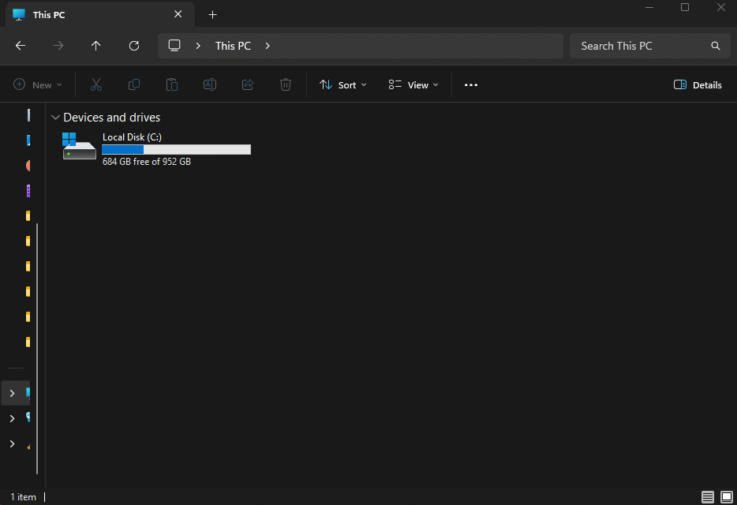

# cds-text-sync

**Version**: `1.0.0-beta`

> [!WARNING]
> **⚠️ BETA SOFTWARE - USE WITH CAUTION ⚠️**
>
> This product is **NOT YET RELEASED** and is currently in active development.
> - Features may be incomplete or unstable
> - Breaking changes may occur without notice
> - **ALWAYS backup your CODESYS project before using these scripts**
> - Test thoroughly in non-production environments first

> [!IMPORTANT]
> **Disclaimer**: This is a third-party tool. It is NOT an official product of CODESYS Group and is not affiliated with, sponsored by, or endorsed by CODESYS Group. This tool is provided "as is" and is not a replacement for official CODESYS products (such as CODESYS Git).

This repository contains a set of Python scripts for **CODESYS** that facilitate two modern Git-based workflows:

### 2. ⚡ External Editing & Sync (The "Developer" Workflow)
- **Goal**: Edit code using modern external tools (VS Code, Copilot/LLMs) and sync changes back to CODESYS.
- **Method**: Exports logic (POUs, GVLs, DUTs) to clean **Structured Text (.st)** files.
- **Benefit**: You can refactor code, use AI assistants, or mass-edit variables externally. The `Project_import.py` script then seamlessly updates your open CODESYS project with the new logic.

---



---


## 🚀 Key Features

- **Reversible Sync**: Round-trip editing for Structured Text files.
- **Safety**: Built-in checks to prevent overwriting the wrong project.
- **Bi-directional Deletion**: Keep your file system and CODESYS project in sync by removing orphaned files or objects.

---

## 🛠️ Installation

1. **Copy Files**: Copy all `.py` files to the CODESYS scripts directory:
   `C:\Users\<YourUsername>\AppData\Local\CODESYS\ScriptDir\`

2. **Access in CODESYS**:
   - The scripts will be available in **Tools > Scripting > Scripts > P**.
   - Note: They appear in the "P" sub-menu because they all start with `Project_`.

3. **Add to Toolbar (Optional but Recommended)**:
   - Go to **Tools > Customize > Toolbars**.
   - Select **Standard** (or create a new one).
   - Click **Add Command**.
   - Look for **ScriptEngine Commands > P**.
   - Add the desired scripts to your toolbar for one-click access.

---

## 📖 Script Overview

### Core Scripts

#### 1. `Project_directory.py`
**The First Step.** Run this to select the folder where the project sync will take place. 
- Requires an open project.
- Saves the path strictly to **Project Information > Properties** (`cds-sync-folder`).
- This binds the sync folder to the specific CODESYS project file.

#### 2. `Project_export.py`
Exports the current CODESYS project to the selected directory.
- Creates `.st` files for all POUs, Methods, Actions, Properties, GVLs, and DUTs.
- Generates `_config.json` and `_metadata.csv` files with project info, sync settings, and object mappings.
- **Safety Check**: Warns if exporting to a directory containing a different project's files.
- **Orphan Cleanup**: Detects and offers to delete files on disk that no longer exist in the CODESYS project.
- **Library Export**: Saves all project libraries and their versions to `_libraries.csv` for version control.
- **CRITICAL**: Do not delete metadata files, as they are required for importing.

#### 3. `Project_import.py`
Reads the `.st` files in your sync directory and updates the CODESYS project.
- **Smart Update**: Matches existing files to CODESYS objects using metadata.
- **New Creation**: Automatically creates new Folders, POUs, GVLs, and DUTs found in the file system.
- **Child Objects**: Supports creating Methods, Actions, and Properties (e.g., `MyPOU.MyAction.st`).
- **Warning**: This will overwrite the code in your open CODESYS project. Always have a backup!
- **Sync Deletions**: If you delete a file on disk, the importer will offer to delete the corresponding object in CODESYS.
- **Library Sync**: Detects missing libraries or version mismatches against `_libraries.csv` and offers to update the CODESYS project.

#### 3. `Project_parameters.py`
Configure sync parameters for the **current project**.
- Allows changing the sync timeout and toggling XML export.
- All changes are saved directly to **Project Information > Properties**.

### ⏳ Planned / Experimental (Currently Unavailable)

#### `Project_ImportSync.py` (AutoSync)
⚠️ **Currently Unavailable / Experimental.**
A script for automatic change monitoring. Version 1.1.0-beta is undergoing refactoring to align with the new project properties logic.


### Shared Modules

#### `codesys_constants.py`
Central repository for CODESYS type GUIDs and constants.
- Defines `EXPORTABLE_TYPES` (ST) and `XML_TYPES` (Native XML)

#### `codesys_utils.py`
Common utility functions used across all scripts.

---

## 🔄 Recommended Workflow

1.  Run **`Project_export.py`**.
2.  Open the `.st` files in VS Code / Cursor to edit logic.
3.  Run **`Project_import.py`** to push logic changes back to the PLC.

**Why focus on ST?**
Structured Text files are perfect for editing, refactoring, and AI assistance. They provide a clean representation of the project logic that is easy to manage in Git.

---

## ⚠️ Important Notes

- **⚠️ BETA STATUS**: This software is in active development. **Always backup your project** before using any script.
- **Metadata**: Project settings are stored in `_config.json` and object mappings in `_metadata.csv`. Don't modify the CSV file manually.
- **Library Tracking**: Library versions are stored in `_libraries.csv` for version control.
- **CRITICAL**: `_libraries.csv` is a machine-generated file. **DO NOT MODIFY IT MANUALLY**. Any manual changes will be overwritten during the next export.
- **Library Sync Limitations**: The import script detects version mismatches. If the script reports differences, you MUST update libraries manually via the CODESYS Library Manager to match the versions in the CSV.
- **Metadata Versioning**: If you update these scripts, you MUST perform a fresh **Export from IDE** to regenerate the metadata. It is recommended to clean the export folder first.
- **Backups**: Always save a `.project` backup before running an import.
- **Creating New Blocks**: You can now create new `.st` files and folders directly in your OS. The import script will automatically create the corresponding objects (POUs, GVLs, Folders) in CODESYS.

---

## 📚 Library Version Control

The `_libraries.csv` file tracks all library dependencies and their versions. This enables:
- **Version consistency** across different project instances
- **Git-based tracking** of library changes
- **Automatic detection** of version mismatches during import

### File Format

```csv
Name;Version;Company;Namespace;IsPlaceholder
Standard;3.5.18.0;System;Standard;True
FloatingPointUtils;4.0.0.0;System;FloatingPointUtils;True
SM3_Basic;4.20.0.0;CODESYS;SM3_Basic;True
```

### How It Works

1. **Export**: `Project_export.py` extracts current library versions (preferring manually selected versions over wildcards) and saves them to `_libraries.csv`.
2. **Version Control**: Commit `_libraries.csv` to Git to track dependency changes.
3. **Import**: `Project_import.py` compares the CSV with the IDE state and warns about missing or mismatched versions.
4. **Manual Sync**: If warned, open Library Manager and update libraries to the specific versions listed in the CSV.

---

## 📝 Changelog

### Version 1.1.0-beta (2026-01-30)

**Full Project Integration (Project-Bound Config):**
- **Source of Truth**: All synchronization settings (`folder`, `timeout`, `xml_export`, `timestamp`) are now stored within the `.project` file under **Project Information > Properties** using the `cds-sync-` prefix.
- **Portability**: Sync settings are preserved when the project file is moved to another computer.
- **Legacy Cleanup**: Removed dependence on the global `BASE_DIR` file and local `_config.json` as the sole source of settings.
- **Mirroring**: Configuration is mirrored to JSON files during export for compatibility with external tools.
- **AutoSync Status**: The automatic sync script is temporarily disabled to focus on the stability of the core engine.

### Version 1.0.0-beta (2026-01-30)

**Reliability & Performance Milestone:**
- **Dynamic Parent Resolution**: Newly created child objects (Methods, Actions, Properties) now correctly identify and link to their parents even when created in the same import session.
- **Folder Path Integrity**: Fixed bug where new objects sometimes defaulted to the root; they now strictly follow the folder structure defined in the file system.
- **CSV Metadata Engine**: Switched to a CSV-backed metadata system for significantly faster data access and zero corruption risk from semicolons or special characters.
- **Git Hygiene**: Explicitly untracked local configuration files (`Project_parameters.py`, `Project_ImportSync.py`) and temporary files to keep repositories clean.

### Version 0.9.9-beta (2026-01-29)

**Major Storage Update:**
- **Split Metadata**: Replaced `_metadata.json` with `_config.json` (JSON) and `_metadata.csv` (CSV) for better performance and scalability.
- **Improved Hashing**: Unified ST content formatting ensures consistent hashes regardless of trailing whitespace.
- **Enhanced Debug Info**: Detailed import/export statistics and progress tracking in the CODESYS console.
- **NOTE**: Transitioning to this version requires a fresh export from the IDE. Clean your export folder before running `Project_export.py`.

### Version 0.9.8-beta (2026-01-29)

**New Features & Improvements:**
- **Orphan Cleanup (Export)**: `Project_export.py` now identifies files in the export directory that are no longer part of the CODESYS project and offers to delete them.
- **Deletion Sync (Import)**: `Project_import.py` now detects when files have been removed from disk and offers to delete the matching objects from the CODESYS IDE.
- **Empty Folder Management**: Automatic cleanup of empty directories during the export process.

### Version 0.9.7-beta (2026-01-20)

**New Features & Improvements:**
- **Function Return Types**: The import script now intelligently parses `FUNCTION` declarations to determine return types (including custom DUTs) and creates them correctly.
- **Property Accessors**: Added support for `Get.st` and `Set.st` files, ensuring they are correctly associated with their parent Properties.
- **Robust Type Detection**: Improved parsing logic to ignore comments and pragmas when determining object types, fixing issues with file headers.
- **Bug Fixes**: Resolved "Access Denied" errors by properly skipping directory checks in the file processing loop.

### Version 0.9.6-beta (2026-01-20)

**New Features:**
- **Full Folder Support**: The importer now creates new folder structures (nested directories) to match your file system.
- **New Object Creation**: You can create `.st` files externally, and they will be imported as new POUs, GVLs, or DUTs.
- **Child Object Support**: Methods, Actions, and Properties (e.g., `Parent.Child.st`) are now correctly identified and created under their parent POU.
- **Robust Import**: Implemented a two-pass import process (Parents then Children) to ensure 100% reliable object creation.

### Version 0.9.2-beta (2026-01-20)

**Major Refactoring:**
- Extracted common code into shared modules (`codesys_constants.py` and `codesys_utils.py`)
- Reduced code duplication by ~300 lines across 5 scripts
- Centralized CODESYS type GUIDs and constants
- Improved maintainability and consistency

**Bug Fixes:**
- **CRITICAL FIX**: Fixed `build_object_cache()` not finding objects when called from imported modules
  - Issue: Imported modules don't have access to CODESYS global variables (`projects`)
  - Solution: Modified function to accept project as parameter
  - Impact: Import and AutoSync now work correctly
- Updated all scripts to pass `projects.primary` to `build_object_cache()`

**New Files:**
- `codesys_constants.py` - Shared constants and type definitions
- `codesys_utils.py` - Shared utility functions
- `debug_metadata.py` - Diagnostic tool for troubleshooting


---

## 📜 License

This project is licensed under the MIT License - see the [LICENSE](LICENSE) file for details.
