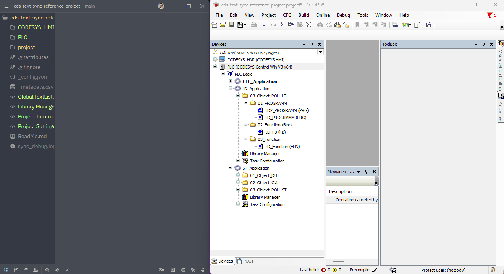
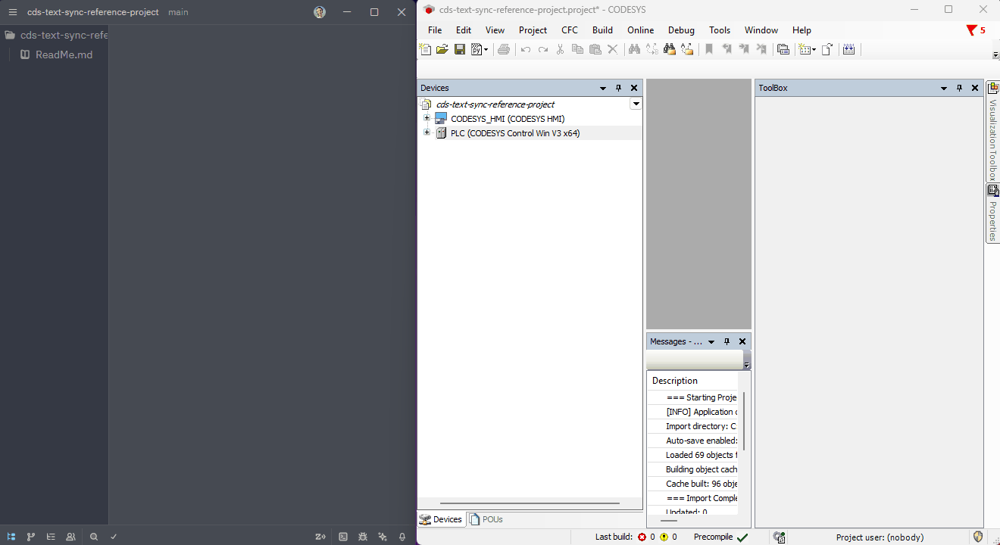
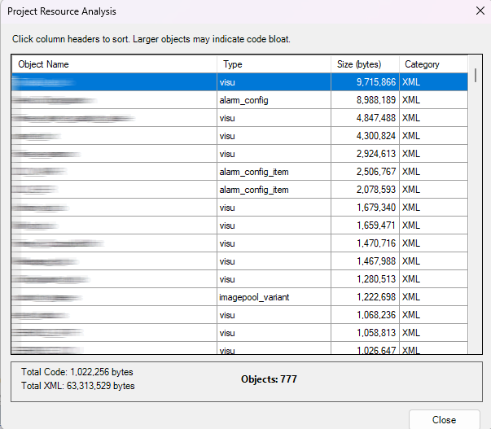

# cds-text-sync: Professional CODESYS Git Sync

**Version**: `1.7.3`

> [!IMPORTANT]
> **Disclaimer**: This is a third-party tool. It is NOT an official product of CODESYS Group and is not affiliated with, sponsored by, or endorsed by CODESYS Group. This tool is provided "as is" and is not a replacement for official CODESYS products.

Professional Git integration for **CODESYS**. Sync Structured Text (ST) with external editors (VS Code, Cursor, Copilot) and manage PLC projects with robust version control.

### ⚡ External Editing & Sync (The "Developer" Workflow)

- **Goal**: Edit code using modern external tools (VS Code, Cursor, Copilot) and sync changes back to CODESYS.
- **Method**: Exports logic (POUs, GVLs, DUTs) to clean **Structured Text (.st)** files.
- **Benefit**: You can refactor code, use AI assistants, or mass-edit variables externally. The `Project_import.py` script then seamlessly updates your open CODESYS project.

---

## 🚀 Key Features

- **High-Performance Sync (90% faster)**: Uses a Merkle Tree-based hierarchical hashing strategy and intelligent caching to skip thousands of redundant API calls, achieving sub-10 second repeat sync times for large projects.
- **Reversible Sync**: Round-trip editing for Structured Text files with modern external tools (VS Code, Cursor, Copilot).
- **Binary Backup (Git LFS)**: Optionally keeps a synchronized copy of your `.project` file for version control.
- **Timestamped Backups with Retention**: Automatically creates safety backups before imports with a configurable retention policy (default: 10 backups).
- **Native XML Export**: Optionally exports visualizations, alarms, and text lists to XML for diffing.
- **Safety**: Built-in checks (PC Name, Project Name) to prevent overwriting the wrong project.
- **Bi-directional Deletion**: Keep your file system and CODESYS project in sync by safely removing orphaned objects when files are deleted on disk.
- **Hidden Folders Skip**: Folders starting with a dot (e.g., `.git`, `.docs`) are automatically ignored, letting you store documentation or tools in the sync directory.

---

## Requirements

- **Minimum Version**: CODESYS V3.5 SP10+ (earlier versions might support scripting but lack essential API features for reliable text syncing).
- **Recommended Version**: CODESYS V3.5 SP13 and newer.

---

## 🛠️ Installation

### Method 1: Manual Copy

1. **Copy Files**: Copy ALL `.py` **and** `.pyw` files to the CODESYS scripts directory.
   - **Note on `.pyw`**: These are internal library modules. They are hidden from the CODESYS "Scripts" menu by design to keep your interface clean. Only the `Project_*.py` files will appear as executable commands.

   Depending on your software and setup preference, use one of the following paths:
   - **Standard (User Profile)**: `C:\Users\<YourUsername>\AppData\Local\CODESYS\ScriptDir\`
   - **Standard CODESYS (Manual Setup)**: `C:\Program Files\CODESYS 3.5.18.40\CODESYS\ScriptDir\`
   - **Delta Industrial Automation (DIAStudio)**: `C:\Program Files\Delta Industrial Automation\DIAStudio\DIADesigner-AX 1.9\CODESYS\ScriptDir`

   _(Note: You may need to create the `CODESYS`, `ScriptDir` folder manually if it doesn't exist)_.

### Method 2: Quick PowerShell Setup (Recommended)

Automate the installation and folder creation for Standard (User Profile) with one command:

```powershell
irm https://raw.githubusercontent.com/ArthurkaX/cds-text-sync/main/irm/setup.ps1 | iex
```

> [!NOTE]
> - **No Git required**: This script downloads clean zip archives from GitHub, not the full repository with history.
> - **Choose version**: You can select the latest development version or any stable release from the interactive menu.
> - **Smaller footprint**: Installation is ~5MB instead of ~10MB+ when cloning with full Git history.

> [!TIP]
> For a detailed explanation of what the script does, check the [Quick Setup Guide](irm/setup.md).

2. **Access in CODESYS**:
   - The scripts will be available in **Tools > Scripting > Scripts > P**.

3. **Add to Toolbar (Recommended)**:
   - Go to **Tools > Customize > Toolbars**.
   - Add commands from **ScriptEngine Commands > P**.

   

---

## Upgrading from Previous Versions

When upgrading to a new version of `cds-text-sync`:

1. **Check Stable Releases**: First check if there's a newer stable release at [GitHub Releases](https://github.com/ArthurkaX/cds-text-sync/releases)
2. **Replace All Files**: Copy BOTH `.py` and `.pyw` files, overwriting everything.
   - **Important Note**: If a major refactor (like shifting to shared libraries) occurs, active scripts held in CODESYS memory may become **stale**. After copying new files, it is best to restart CODESYS or reload your project to ensure the Script Engine picks up latest version of all modules.
3. **Clean Export**: Run `Project_export.py` to refresh metadata and ensure your disk state matches the new script logic.
4. **Commit Changes**: Review and commit the changes in Git.

> **Tip**: A clean export after upgrading ensures all files use the latest export format and prevents inconsistencies.
> 
> **Rollback**: If you encounter issues with a new version, see [Stable Releases & Rollback](#-stable-releases--rollback) section for how to safely revert to a previous stable version.

---

## 🎯 Stable Releases & Rollback

We maintain **stable, manually tested releases** for safe production use.

### Finding Stable Releases
- **GitHub Releases**: All stable releases are tagged and published on [GitHub Releases](https://github.com/ArthurkaX/cds-text-sync/releases)
- **Latest Tagged Version**: The most recent stable version is marked as "Latest Release"
- **Changelog**: See [CHANGELOG.md](CHANGELOG.md) for detailed change history

### Rolling Back to a Stable Version
If you encounter bugs in a newer version:

**Option 1: Git Rollback (Recommended)**
```bash
# Check available stable tags
git tag

# Rollback to specific stable version (e.g., v1.7.2)
git checkout v1.7.2

# Update your CODESYS scripts with the stable version
# Follow the installation steps to copy the files
```

**Option 2: Download from GitHub Releases**
1. Go to [GitHub Releases](https://github.com/ArthurkaX/cds-text-sync/releases)
2. Download the release archive for the stable version
3. Extract and copy the scripts to your CODESYS ScriptDir

> [!NOTE]
> You can also use the **Quick PowerShell Setup** script (Method 2 above) which automatically downloads stable releases as clean zip archives without requiring Git installation.

### Version Policy
- **Tags starting with `v`**: Official stable releases (e.g., `v1.7.3`, `v1.7.2`)
- **Main branch**: Latest development code (may be unstable)
- **Testing**: All stable releases are manually tested before tagging

> [!NOTE]
> Always backup your project before rolling back to a different version.

---

## 📖 Script Overview

### 1. `Project_directory.py` (Setup)

**Run this first.** It links your current CODESYS project to a specific folder on your disk.



- Offers two options:
  - **Browse**: Select a folder using the file browser (traditional method).
  - **Manual Input**: Enter a path manually, supporting both absolute and relative paths.
- **Relative Path Support**:
  - Use `./` to sync to the same directory as your project file.
  - Use `./src/` or `./foldername/` to sync to a subfolder relative to your project.
  - **Perfect for team collaboration**: Relative paths work on any machine without reconfiguration, as they're resolved relative to the project file location.
  - The folder will be created automatically if it doesn't exist.
- Saves the path (`cds-sync-folder`) and current machine name (`cds-sync-pc`) to **Project Information > Properties**.
- This binding ensures you don't accidentally sync to the wrong folder.

**Examples**:

- Absolute path: `C:\MyProjects\MyPLC\sync\`
- Relative path (project directory): `./`
- Relative path (subfolder): `./sync/` or `./git-repo/src/`

### 2. `Project_parameters.py` (Configuration)

**Configure how the sync works.** Runs an interactive menu to toggle options. Settings are saved in the project file.

- **[ ] Export Native XML**:
  - If ENABLED: visual objects (Visualizations, Alarms, ImagePools) are exported to `/xml` folder in PLCopenXML format.
  - Useful for tracking changes in non-textual objects.
- **[ ] Backup .project binary**:
  - If ENABLED: the script creates a copy of your `.project` file in the `.project/` folder.
  - Essential for **Git LFS** workflows. Ensures your binary state matches your code state.
- **Set Backup Name**:
  - Allows you to specify a **fixed filename** for the binary backup (e.g., `Project`).
  - **Why use it?** If you often rename your `.project` files or work in a team where project names vary, setting a fixed name ensures the backup always overwrites the same file. This keeps your `.project/` folder clean and prevents Git history from being cluttered with "new" files that are just renamed versions of the old ones.
- **[ ] Save Project after Export**:
  - If ENABLED: automatically saves the project after a successful export operation.
- **[ ] Save Project after Import**:
  - If ENABLED: automatically saves the project after a successful import.
- **[ ] Timestamped Backup before Import**:
  - If ENABLED: creates a unique, timestamped `.bak` file in the `.project/` folder _before_ starting the import process.
- **Max Backups to Keep**:
  - Sets the number of timestamped backups to keep (default: 10). The script automatically cleans up older backups while preserving your primary Git LFS backups.

### 3. `Project_export.py` (CODESYS -> Disk)

Exports the current project state to the sync folder.



- **Source Code**: Exports all POUs, GVLs, DUTs to `/src` as `.st` files.
- **Libraries**: Saves `_libraries.csv` for dependency tracking.
- **Binary Backup**: If enabled, saves the project and copies it to `.project/`.
- **Cleanup**: Detects files on disk that no longer exist in CODESYS and offers to delete them.

### 4. `Project_import.py` (Disk -> CODESYS)

Updates the CODESYS project from the files on disk.

- **Smart Update**: Updates existing objects, creates new ones, and builds folder hierarchies.
- **Deletions**: If a file was deleted from disk (e.g. via git pull), the script will now safely remove the corresponding object from the CODESYS project, ensuring your IDE matches your repository.
- **Safety Backup**: If enabled, creates a timestamped project backup (`YYYYMMDD_HHMMSS_ProjectName.project.bak`) before modifying any code in the `.project/` folder.
- **Binary Sync**: If "Backup .project binary" is enabled, it **automatically saves** the project after import and updates the binary backup, ensuring Git consistency.

### 5. `Project_compare.py` (Object Comparison)

**Identify differences between IDE and Disk.** Compares the objects in your CODESYS project with the exported files on disk using the new direct-comparison engine.


- **Detection**: Finds modified objects, new objects in IDE, and objects deleted from IDE.
- **Interactive Update**: Launches a dialog where you can selectively **Import** disk changes into CODESYS or **Export** IDE changes to disk.
- **Output**: Generates a detailed report in the Script Output window and saves it to `compare.log`.
- **External Diff**: If you need to compare large files (like XML) in an external editor (VS Code, WinMerge):
  - **Press CTRL + Click "Diff"** in the comparison dialog.
  - This saves both versions (IDE and Disk) to the **`.diff/`** folder in your project directory.
  - You can then open these files in your favorite diff tool.
- **Clean Run**: The `compare.log` file is recreated every time you run the script, ensuring you only see the latest results.

### 6. `Project_discover.py` (Diagnostic Tool)

**Diagnostic tool for project structure.** Maps your CODESYS project tree and helps identify objects that might not be fully supported by the sync engine yet.

- **Validation**: If you run this on a project, check `sync_debug.log` to see a full tree of discovered objects and their types.
- **Debugging**: Highlights "Unknown" types with their GUIDs, making it easy to report unsupported blocks.

### 7. `Project_resources.py` (Size Analysis)

**Analyze project objects by size/complexity.** Helps identify "code bloat" by measuring source code length and XML export size for graphical objects.



- **Interactive Grid**: Results displayed in a sortable dialog showing Object Name, Type, Size, and Category (Code/XML).
- **Identify Bloat**: Quickly find large visualizations, complex POUs, or oversized configurations.
- **Summary Stats**: Shows total code volume, XML volume, and object count.

### 8. `Project_Build.py` (Build & Diagnostic Log)

**Trigger a build and get detailed error reporting.** Compiles the active application and generates a clean, readable table format in `build.log`.

- **Accurate Line Numbers**: Translates internal CODESYS offsets into real line/column numbers for Structured Text files, making it easier to fix errors in external editors.
- **Multi-App Support**: Detects multiple applications and allows you to select which one to compile.
- **Visual Feedback**: Shows a final summary including error/warning counts and compilation duration.

### 9. `Project_perf_test.py` (Benchmarking)

**Performance profiling tool.** Measures exact execution times for object discovery, comparison, and hashing.

- **Wait/API Analysis**: Identifies slow spots in the sync process (e.g., slow COM API calls).
- **Cache Hit Ratio**: Reports how effective the `sync_cache.json` and Merkle Tree skips are for your specific project structure.

---

## 🤝 Team Collaboration

For projects involving multiple engineers, we recommend a structured Git-based workflow.

- **[Detailed Team Workflow Guide](WORKFLOW.md)**: Learn how HMI/Hardware engineers and software developers can collaborate effectively using branches and Pull Requests.

---

## 🏗️ Project Structure

The tool organizes your repository into a clean structure:

```
/
├── DeviceName/            # PLC Device Name (Not synced, used as folder)
│   └── ApplicationName/   # Application Name (Logic & Config root)
│       ├── Folder/        # Project Folders (mirrors IDE tree)
│       │   └── POU.st     # Logic Source code (.st files)
│       ├── Task Config.xml# Native XML Configuration (Tasks)
│       └── Library Mgr.xml# Native XML for Libraries
├── GlobalTextList.xml     # Global objects (Project-level root)
├── .project/            # (Optional) Binary .project backup for Git LFS
├── .diff/               # (Temporary) Files for external diff tool (CTRL + Diff)
├── sync_cache.json      # Cache for performance optimization
├── sync_metadata.json   # Metadata about the actions performed by the script
├── sync_debug.log       # Diagnostic log for sync/discovery
├── build.log            # Build output log
└── compare.log          # Comparison results log

```

> [!TIP]
> **Use Dot-Folders for Extra Content**: Since the engine ignores all folders starting with a dot, you can safely create folders like `.docs/`, `.libs/`, or `.gsd/` to store project-related files. They won't be deleted during "Export" and won't clutter your "Compare" results.

---

## 🧠 Recommended Workflow with Git LFS

1.  **Configure**: Run `Project_parameters.py` and enable **"Backup .project binary"**.
2.  **Export**: Run `Project_export.py`.
    - Code goes to `/src`.
    - Binary goes to `.project/`.
3.  **Commit**:
    - `git add .`
    - `git commit -m "Update logic"`
    - Git tracks the text in `src/`.
    - **Git LFS** tracks the binary in `.project/`.
4.  **Edit**: make changes in VS Code or CODESYS.
5.  **Sync**: Run `Project_import.py` or `Project_export.py` depending on where you edited.
    - The binary backup is automatically updated on every sync.

### ❓ Why Git LFS for `.project`?

Since `.project` is a **binary file**, standard Git is not efficient at tracking its changes.

- **Prevents Bloat**: Normal Git stores the _entire file_ for every commit. If your project is 10MB, 100 commits would make your repo 1GB. LFS prevents this.
- **Performance**: You only download the binary version you are currently working on, keeping `git clone` and `git fetch` fast.
- **Code-Binary Sync**: It allows you to keep the "full state" of the project (Visualizations, HW config) exactly matched with the "logic state" in `src/`.

> [!NOTE]
> Git LFS is **optional** and only needed if you want to version control your `.project` binary files. The `cds-text-sync` tool itself does not require Git to be installed for normal operation.

---

## 🧪 Reference Project & Examples

To keep this repository lightweight and minimalist for users who `git clone` the scripts, all test cases, problematic objects, and compatibility examples are hosted in a separate **[Reference Project](https://github.com/ArthurkaX/cds-text-sync-reference-project)**.

Refer to that repository's README for detailed verification procedures and contribution guidelines.

---

## 🗣️ Community & Future Roadmap

While Issues are great for reporting bugs, I invite you to join our **[GitHub Discussions](https://github.com/ArthurkaX/cds-text-sync/discussions)** for everything else! There you can suggest improvements and influence the development of the project.

---

## 📝 Changelog

See the full [CHANGELOG.md](CHANGELOG.md) for details on all versions.

For stable releases and download links, check [GitHub Releases](https://github.com/ArthurkaX/cds-text-sync/releases).

---

## 📜 License

MIT License.
